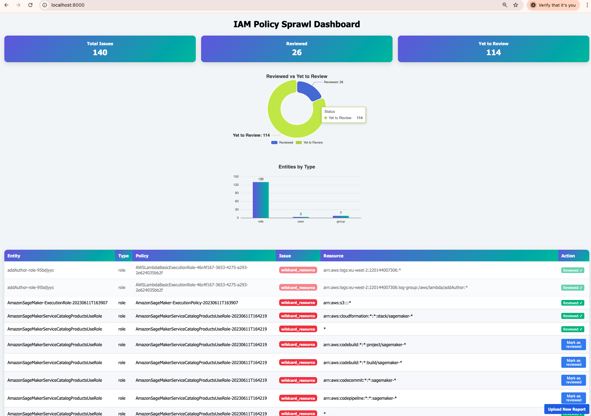
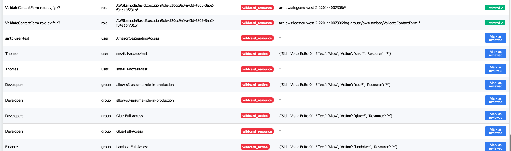

# 🧭 IAM Sprawl Scanner

  

*A lightweight  AWS IAM analyzer that visualizes permission sprawl.*
 
---

## 💡 About

 
 
### _"How I reduced S3 permissions by 90% in 2 minutes."_

This started as a weekend experiment to answer one simple question: 

> “How many of my IAM roles still have `*` in their policies?”

I was curious, so I wrote a quick script — and it turned into a small tool that makes those findings **visible, actionable, and easy to review**.

It runs locally, uses your existing AWS credentials, and is completely free.

Obviously, full IAM analyzers can do thousands of things, but sometimes you just want something **simple and focused**, without clicking through endless AWS console screens.
  

It’s not meant to replace enterprise tools — just to give you **clarity in two minutes**.

---

  

## 🚀 How to Run

  

### 1️⃣ Clone the repo

```bash

git clone https://github.com/faalantir/iam-sprawl.git

cd iam-sprawl
```  
### 2️⃣ Install  dependencies

```bash
pip install  fastapi  uvicorn  jinja2  boto3
```
###  3️⃣ Run  the  scan
#####
```bash
Export your AWS_PROFILE or ensure your defaault IAM user has atleast following read permissions
(`iam:ListRoles`, `iam:ListUsers`, `iam:ListGroups` `iam:ListAttachedRolePolicies`, `iam:ListAttachedUserPolicies`, `iam:ListAttachedGroupPolicies`  `iam:ListRolePolicies`, `iam:ListUserPolicies`, `iam:ListGroupPolicies` `iam:GetRolePolicy`, `iam:GetUserPolicy`, `iam:GetGroupPolicy` `iam:GetPolicy`, `iam:GetPolicyVersion`  `cloudtrail:LookupEvents` )

# This will generate report.json file
python iam_sprawl_scanner.py
```

### 4️⃣ Start  the  dashboard
```bash
# This starts the uvicorn server and reads the report.json file, generated above.
python app.py 
```

Then open  http://localhost:8000

  

That’s it  —  runs  locally  using  your  existing  AWS  credentials (like awscli).

  

### 📊 Dashboard  Preview

Here’s what  the  visual  output  looks  like:



And here with different types




  

### 🧩 What  It  Shows

Roles, users,  and  groups  with  wildcard  or  risky  permissions  
A clean  visual  dashboard (ECharts +  Tailwind)
Reviewed vs  Pending  summaries

Quick prioritization  of  least-secure  IAM  entities
 

### 🤝 Why  Share  This

IAM sprawl  is  something  everyone  hits  sooner  or  later.

This small  script  helped  me  see  my  own  landscape  clearly  —  so  I  thought  others  might  find  it  useful  too.
If you  try  it,  let  me  know  what  you  think  or  what  you’d  improve.


### ⚙️ Tech  Stack
Python •  FastAPI  •  Boto3  •  Tailwind  CSS  •  ECharts